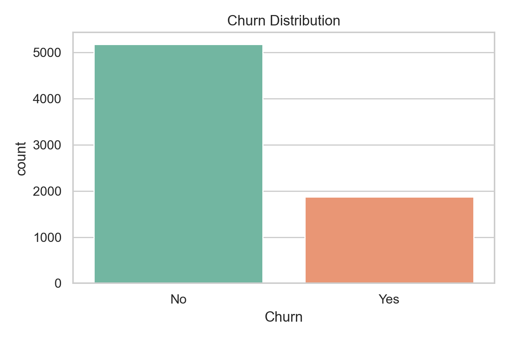
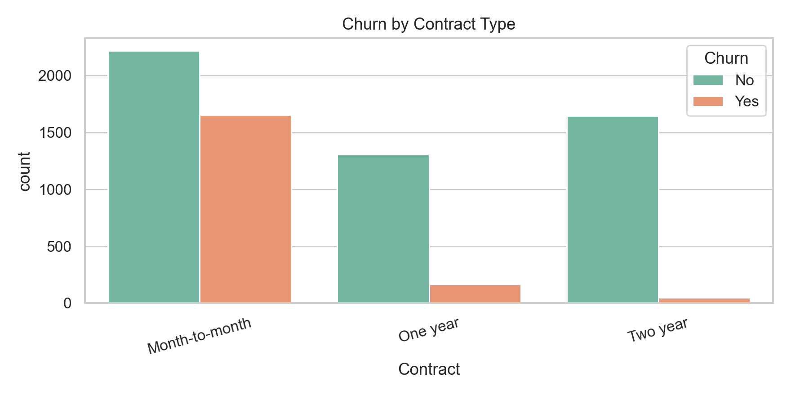
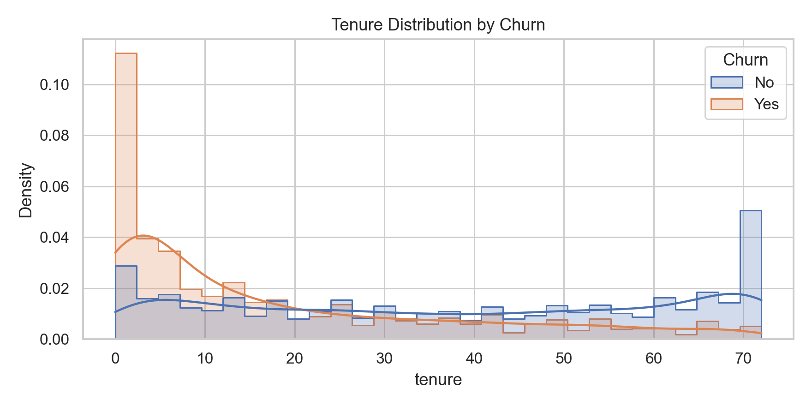
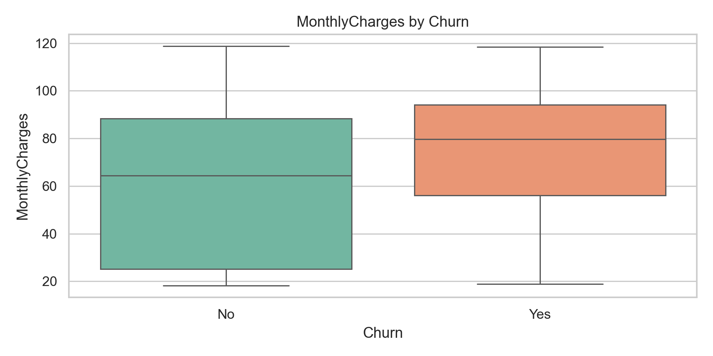
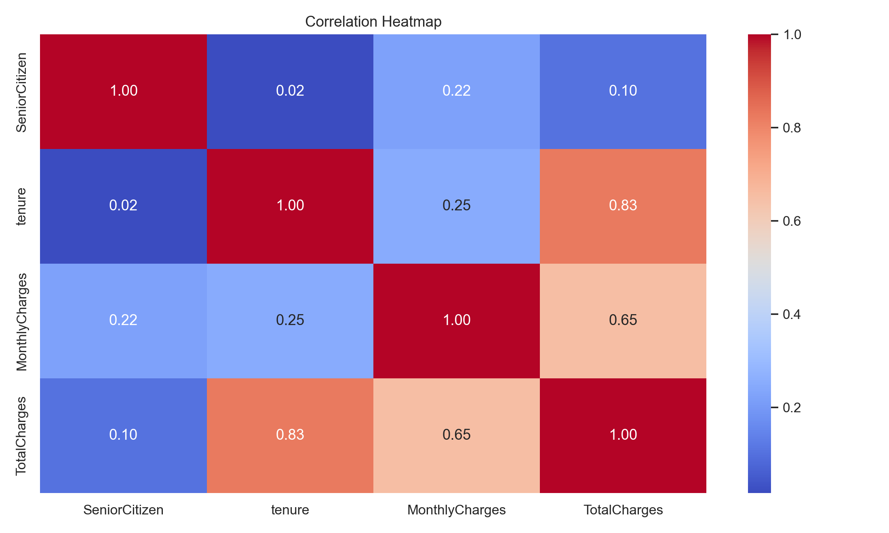
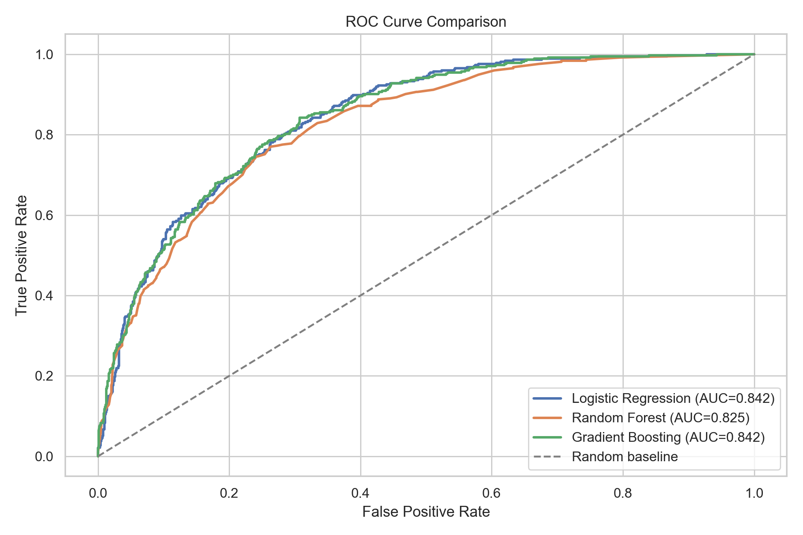
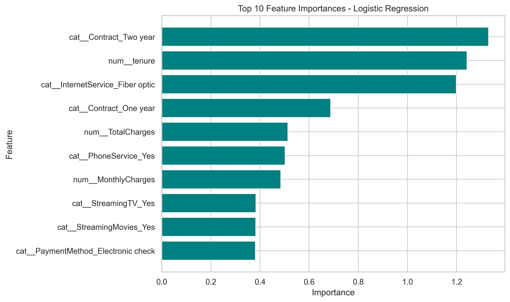

# Customer Churn Prediction Project

## Results Snapshot
- Best model: **Logistic Regression**
- F1-score (test): **0.6040**
- ROC-AUC (test): **0.8420**
- Class balance: **73.46% No Churn** vs **26.54% Churn**
- Data shape: **7043 rows x 21 columns**
- Final encoded feature space: **30 features**

Quick links:
- ROC curve: [reports/figures/roc_curve_comparison.png](reports/figures/roc_curve_comparison.png)
- Feature importance: [feature_importance.png](feature_importance.png)
- Model comparison table: [reports/tables/model_comparison.csv](reports/tables/model_comparison.csv)

## Project Goal
Predict whether a telecom customer will churn (Yes/No) using the IBM Telco Customer Churn dataset.

## Tech Stack
- Python
- Pandas
- Scikit-learn
- Matplotlib
- Seaborn
- Streamlit
- Joblib

## Project Structure

```text
churn-prediction/
├── data/
│   └── telco_churn.csv
├── notebooks/
│   └── eda_and_model.ipynb
├── reports/
│   ├── figures/
│   └── tables/
├── .streamlit/
│   └── config.toml
├── Dockerfile
├── .dockerignore
├── render.yaml
├── runtime.txt
├── app.py
├── model.pkl
├── feature_cols.pkl
├── feature_importance.png
├── requirements.txt
└── README.md
```

## Dataset Stats
Source: IBM Telco Customer Churn dataset (Kaggle)

- Total rows: 7043
- Total columns: 21
- Missing values in raw file: 0
- TotalCharges nulls after numeric conversion: 11
- Churn = No: 5174 (73.46%)
- Churn = Yes: 1869 (26.54%)

## Data Preparation Stats
- Train size: 5634 rows
- Test size: 1409 rows
- Encoded feature count after preprocessing: 30
- Split strategy: 80/20, stratified, random_state=42
- Target mapping: Yes -> 1, No -> 0
- Categorical encoding: OneHotEncoder(drop_first=True)
- Numeric scaling: StandardScaler

## EDA Graphs

### 1) Churn Distribution


### 2) Churn by Contract Type


### 3) Tenure Distribution by Churn


### 4) MonthlyCharges by Churn


### 5) Correlation Heatmap


## Model Comparison (Primary metric: F1, Secondary metric: ROC-AUC)

| Model | Precision | Recall | F1 | ROC-AUC |
|---|---:|---:|---:|---:|
| Logistic Regression | 0.6572 | 0.5588 | 0.6040 | 0.8420 |
| Gradient Boosting | 0.6531 | 0.5134 | 0.5749 | 0.8421 |
| Random Forest | 0.6216 | 0.4920 | 0.5493 | 0.8246 |

Selected best model for deployment: **Logistic Regression**

### ROC Curve Comparison


## Top Feature Importance (Best Model)

| Rank | Feature | Importance |
|---:|---|---:|
| 1 | cat__Contract_Two year | 1.3301 |
| 2 | num__tenure | 1.2425 |
| 3 | cat__InternetService_Fiber optic | 1.1990 |
| 4 | cat__Contract_One year | 0.6878 |
| 5 | num__TotalCharges | 0.5133 |
| 6 | cat__PhoneService_Yes | 0.5018 |
| 7 | num__MonthlyCharges | 0.4845 |
| 8 | cat__StreamingTV_Yes | 0.3832 |
| 9 | cat__StreamingMovies_Yes | 0.3826 |
| 10 | cat__PaymentMethod_Electronic check | 0.3811 |

### Feature Importance Plot


## Saved Artifacts
- Trained model: `model.pkl`
- Encoded feature list: `feature_cols.pkl`
- Feature importance plot: `feature_importance.png`
- Model comparison table: `reports/tables/model_comparison.csv`
- Top features table: `reports/tables/top_features.csv`
- Summary stats: `reports/tables/summary_stats.json`

## How To Run

### 1) Install dependencies
```bash
py -m pip install -r requirements.txt
```

### 2) Run notebook (EDA + training + saving artifacts)
Open and run all cells in:
- `notebooks/eda_and_model.ipynb`

### 3) Run Streamlit app
```bash
py -m streamlit run app.py
```

## Deployment

### Option 1: Streamlit Community Cloud
1. Push this project to a GitHub repository.
2. Open Streamlit Community Cloud and create a new app from your repo.
3. Set the app entrypoint to `app.py`.
4. Ensure `requirements.txt` is in repo root (already done).
5. Deploy.

Notes:
- `runtime.txt` is included to target Python 3.11.9.
- If your app fails due to package resolution, redeploy after clearing app cache in Streamlit Cloud settings.

### Option 2: Render (Docker)
1. Push this project to GitHub.
2. In Render, create a new Web Service from the repo.
3. Render auto-detects Docker via `Dockerfile`.
4. Keep defaults; `render.yaml` is included for service definition.
5. Deploy and open the generated URL.

### Option 3: Any Docker Host (Railway, Azure Web App for Containers, VM)
Build image:
```bash
docker build -t churn-predictor .
```

Run container:
```bash
docker run -p 8501:8501 churn-predictor
```

The container starts with:
- `streamlit run app.py --server.port=${PORT:-8501} --server.address=0.0.0.0`

### Common Issue: `py -m streamlit run app.py` exits with code 1
Try these checks:
1. Confirm you are in the project folder where `app.py` exists.
2. Reinstall dependencies:
```bash
py -m pip install -r requirements.txt
```
3. Try another port:
```bash
py -m streamlit run app.py --server.port 8502
```
4. If a previous Streamlit process is stuck, stop it and rerun.

## Streamlit App Inputs
- tenure (slider 0-72)
- MonthlyCharges (number_input)
- TotalCharges (number_input)
- Contract (selectbox)
- InternetService (selectbox)
- PaymentMethod (selectbox)
- SeniorCitizen (checkbox)
- PaperlessBilling (checkbox)
- OnlineSecurity (selectbox)
- TechSupport (selectbox)

On clicking Predict:
- Builds input row and applies training-equivalent preprocessing
- Aligns features to saved `feature_cols.pkl`
- Shows churn probability metric
- Shows probability progress bar
- Shows high-risk warning (error) if probability > 0.5, otherwise success message

## Notes
- Random seed is fixed to 42 for reproducibility.
- F1-score and ROC-AUC are treated as primary evaluation criteria.
